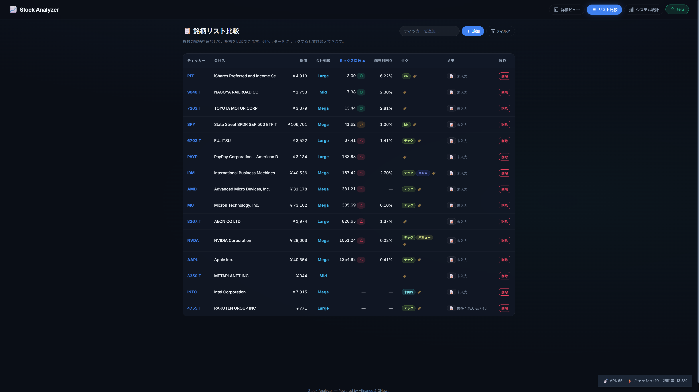
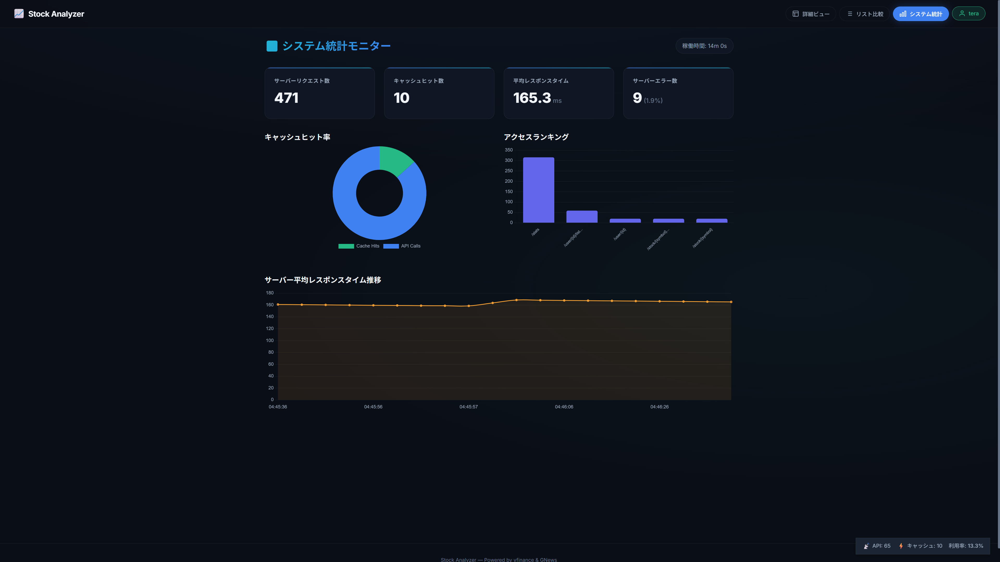
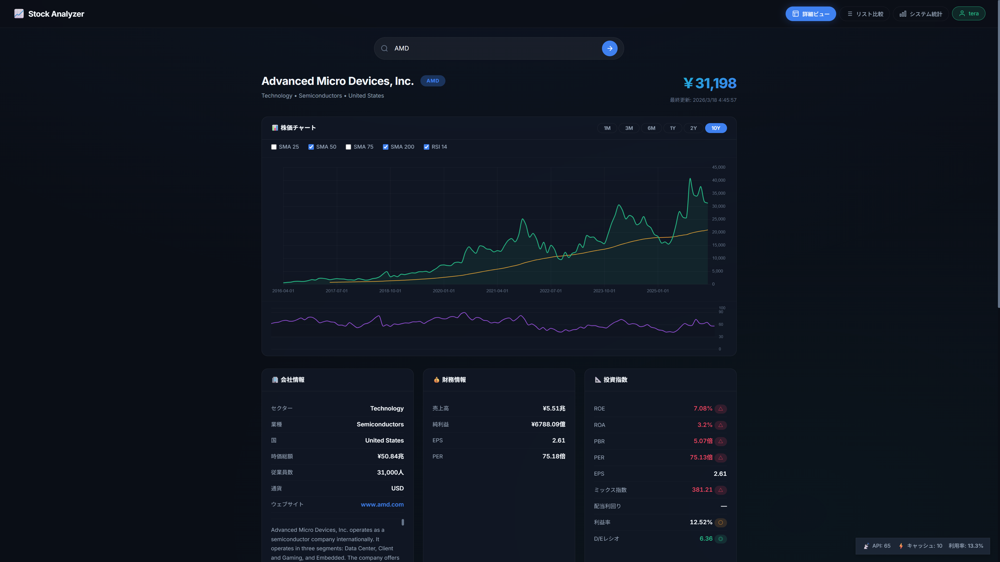

# Stock Data API

株式分析・為替確認・ウォッチリスト管理をまとめて扱える FastAPI ベースの REST API です。

## このAPIでできること

| 分類 | 主な機能 | 主なエンドポイント |
|---|---|---|
| 株価 | 現在価格、過去価格の取得 | `GET /stock/{symbol}`、`GET /stock/{symbol}/history` |
| 企業分析 | 財務情報、企業プロフィール、投資指標の取得 | `GET /stock/{symbol}/financials`、`GET /stock/{symbol}/profile`、`GET /stock/{symbol}/indicators` |
| ニュース | 銘柄関連ニュースの取得 | `GET /stock/{symbol}/news` |
| 為替 | 通貨ペアの現在レート取得 | `GET /forex/{pair}` |
| ユーザー機能 | ユーザー登録/ログイン、銘柄リスト管理、タグ管理 | `POST /user/register`、`POST /user/login`、`/user/{user_id}/lists...` |
| 運用 | API利用統計の取得 | `GET /stats` |

## 機能詳細

### 1. 株価・分析データ

- 現在株価: `GET /stock/{symbol}`
- 過去株価: `GET /stock/{symbol}/history`
- 財務情報: `GET /stock/{symbol}/financials`
- 企業プロフィール: `GET /stock/{symbol}/profile`
- 投資指標: `GET /stock/{symbol}/indicators`
- 関連ニュース: `GET /stock/{symbol}/news`

`history` の主なクエリパラメータ:

| パラメータ | 説明 | 例 |
|---|---|---|
| `start_date` | 開始日 (`YYYY-MM-DD`) | `2025-01-01` |
| `end_date` | 終了日 (`YYYY-MM-DD`) | `2025-01-31` |
| `interval` | 取得間隔 | `1d`, `1wk`, `1mo` |

### 2. 為替データ

- 為替レート: `GET /forex/{pair}`
- 例: `USDJPY` を指定すると内部で `USDJPY=X` に補完されます。

### 3. ユーザー・ウォッチリスト

- ユーザー登録: `POST /user/register`
- ログイン: `POST /user/login`
- デフォルトリスト取得: `GET /user/{user_id}/default-list`
- リスト一覧/作成: `GET/POST /user/{user_id}/lists`
- リスト詳細/更新/削除: `GET/PUT/DELETE /user/{user_id}/lists/{list_id}`
- 銘柄追加: `POST /user/{user_id}/lists/{list_id}/items`
- 銘柄削除: `DELETE /user/{user_id}/lists/{list_id}/items/{symbol}`
- タグ更新: `PUT /user/{user_id}/lists/{list_id}/items/{symbol}/tags`

### 4. 統計・キャッシュ

- 利用統計: `GET /stats` で API 呼び出し回数やキャッシュヒット情報を取得
- SQLite を使ったキャッシュで外部APIアクセスを最適化

## セットアップ

```bash
# 依存パッケージのインストール
pip install -r requirements.txt

# サーバー起動
python -m uvicorn app.main:app --reload
```

## ドキュメントとフロントエンド

- Swagger UI: `http://localhost:8000/docs`
- ReDoc: `http://localhost:8000/redoc`
- ルート (`/`) にアクセスすると `frontend/index.html` を返します（存在する場合）

## UIスクリーンショット

### 詳細ビュー



### 銘柄リスト比較



### システム統計



## クイック利用例

```bash
# 現在株価
curl http://localhost:8000/stock/AAPL

# 過去株価
curl "http://localhost:8000/stock/AAPL/history?start_date=2025-01-01&end_date=2025-01-31&interval=1d"

# 会社プロフィール
curl http://localhost:8000/stock/AAPL/profile

# 投資指標
curl http://localhost:8000/stock/AAPL/indicators

# 為替
curl http://localhost:8000/forex/USDJPY

# API統計
curl http://localhost:8000/stats
```
